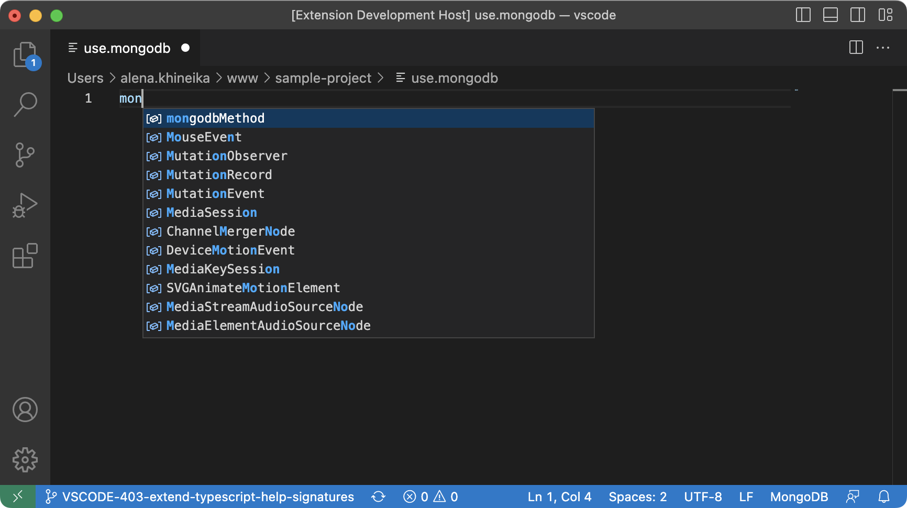

# vscode-js-languageservice-sample

LSP Example for multiple languages support.

## Functionality

This extension contributes a new `mongodb` language. The new language:
- Works with the `.mongodb` file extension.
- Has MongoDB syntax highlighting.
- Completes `mongodbMethod` to illustrate IntelliSense for MongoDB API.
- Provides help signatures for the `mongodbMethod`.

The extension also embeds the `javascript` language to support its language features such as syntax highlighting and code completion. See [VSCode Embedded Programming Languages](https://code.visualstudio.com/api/language-extensions/embedded-languages) for more info.

## Running the Sample

- Run `npm install` in this folder. This installs all necessary npm modules in both the client and server folder.
- Open VS Code on this folder.
- Press `Cmd+Shift+B` to compile the client and server (check your shortcuts config).
- Switch to the Debug viewlet.
- Select `Launch Client` from the drop down.
- Open the `*.mongodb` file.
